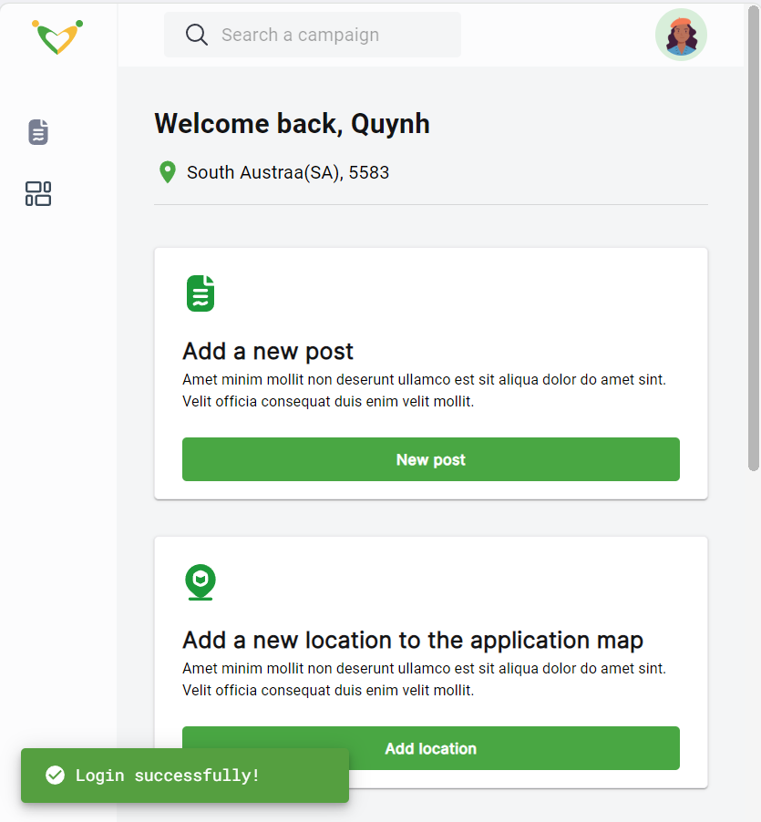
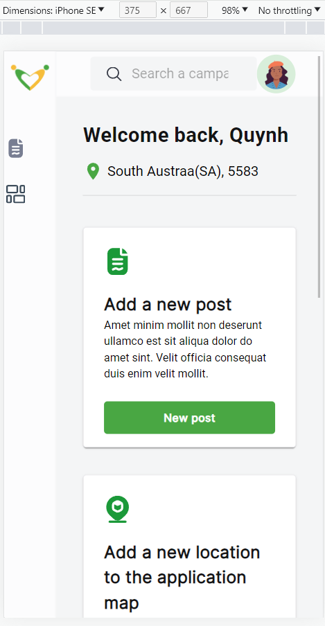

## Food-donation
Ứng dụng web kết nối các nhà hảo tâm và người cần nhận sự hỗ trợ từ cộng đồng
- Dự án cá nhân
  - Front-end: Typescript, Material UI
  - Back-end: NestJS
  - Database: MongoDB Cloud
<div style="display: flex; justify-content: space-between; align-items: center;">
  <div style="flex: 1; text-align: center; padding: 10px;">
    
    <p><em>Cấu trúc dữ liệu users</em></p>
  </div>
  <div style="flex: 1; text-align: center; padding: 10px;">
    
    <p><em>Cấu trúc dữ liệu posts</em></p>
  </div>
</div>

- Design: [link to Figma](https://www.figma.com/design/44Gs3a2a4ung1crYIBmM23/Food-Donation?node-id=264-12178&t=FGJ9xiuYWDo3bnJz-1)
  - Phát triển thêm giao diện trang New Feeds và Admin

- Một số hình ảnh website:


*Giao diện đăng ký, đăng nhập*


*Giao diện dashboard khi admin đăng nhập thành công*
  - Giao diện Admin bao gồm 7 trang: Overview, Post manager, Location, Reward, Payment record, NewsFeed, User Management
  - Giao diện người dùng khác bao gồm các trang NewsFeed và trang tương ứng với vai trò của người dùng đó



*Thiết kế giao diện website responsive cho các màn hình nhỏ hơn như ipad, di động*

## Getting Started
Start project with 2 terminal:
```
cd ./frontend
npm run start
```

```
cd ./backend
npm run dev
```
