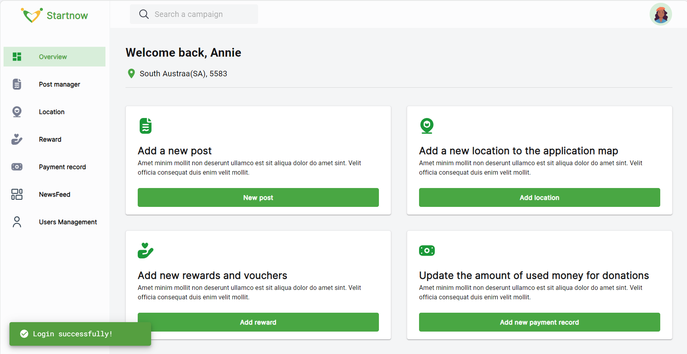

## Food-donation
Ứng dụng web kết nối các nhà hảo tâm và người cần nhận sự hỗ trợ từ cộng đồng
- Dự án cá nhân
* Front-end: Typescript, Material UI
* Back-end: NestJS
* Database: MongoDB Cloud

- Design: [link to Figma](https://www.figma.com/design/44Gs3a2a4ung1crYIBmM23/Food-Donation?node-id=264-12178&t=FGJ9xiuYWDo3bnJz-1)
  + Phát triển thêm giao diện trang New Feeds và Admin
- Một số hình ảnh website:




## Getting Started
Start project with 2 terminal:
```
cd ./frontend
npm run start
```

```
cd ./backend
npm run dev
```
