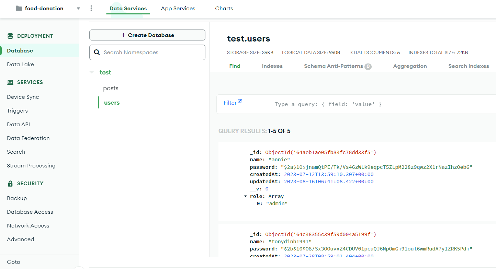

## Food-donation
Ứng dụng web kết nối các nhà hảo tâm và người cần nhận sự hỗ trợ từ cộng đồng
- Dự án cá nhân

- Design: [link to Figma](https://www.figma.com/design/44Gs3a2a4ung1crYIBmM23/Food-Donation?node-id=264-12178&t=FGJ9xiuYWDo3bnJz-1)
  - Phát triển thêm giao diện trang New Feeds và Admin

- Công nghệ sử dụng
  - Front-end: Typescript, Material UI
  - Back-end: NestJS
  - Database: MongoDB Cloud
<p align="center">
  
  
</p>
<p align="center">
  <em>Cấu trúc dữ liệu của users và posts</em>
</p>

## Font-end
Một số hình ảnh website
<div style="display: flex; justify-content: space-between; align-items: center;">
  <div style="flex: 1; text-align: center; padding: 10px;">
    
    <p><em>Giao diện đăng ký</em></p>
  </div>
  <div style="flex: 1; text-align: center; padding: 10px;">
    
    <p><em>Giao diện đăng nhập</em></p>
  </div>
</div>

<div>
    
    <p>
      <em>Giao diện dashboard khi admin đăng nhập thành công</em> <br/>
      <em>+ Giao diện Admin bao gồm 7 trang: Overview, Post manager, Location, Reward, Payment record, NewsFeed, User Management</em> <br/>
      <em>+ Giao diện người dùng khác bao gồm các trang NewsFeed và trang tương ứng với vai trò của người dùng đó</em>
    </p>
</div>

<p align="center">
  
  
</p>
<p align="center">
  <em>Thiết kế giao diện responsive cho các thiết bị nhỏ hơn như ipad, di động</em>
</p>

## Back-end
Configuration 
- Lắng nghe cổng trong file main.ts
- Kết nối database trong file app.module.ts và file .env

Đăng nhập đăng ký
- Xây dựng User schemas và User dto
- Đăng ký: Kiểm tra trùng lặp, hash password sử dụng thư viện bcrypt và thêm tài khoản vừa đăng ký vào database 
- Đăng nhập, điều hướng đến trang Dashboard/Overview

Quản lý phiên đăng nhập bằng access-token 
- Access-token cho mỗi user được cài mã hóa từ _id duy nhất của mỗi người dùng, cài đặt thời gian mặc định cho phiên đăng nhập là 1 ngày trong file .env

Hiển thị các trang trong Dashboard: Overview, NewsFeed

Routing:  
- Sử dụng AuthGuard từ thư viện @nestjs/passport để bảo vệ một số route, đảm bảo rằng người dùng phải đăng nhập hoặc phải có quyền truy cập để thực hiện hành động. Ví dụ áp dụng cho các route liên quan đến quản lý post (người dùng phải đăng nhập mới có thể thực hiện thao tác quản lý post) 
- Điều hướng từ trang Overview đến các trang con
  - Quản lý Post, Location, Reward, Record (thêm, xóa, sửa) và cập nhật bảng hiển thị (Front-end), cập nhật vào database (Front-end call API from Back-end)
  - Admin phân quyền người dùng trong trang User Management, cập nhật thay đổi trên giao diện hiển thị và cập nhật vào database

## Getting Started
Start project with 2 terminal:
```
cd ./frontend
npm run start
```

```
cd ./backend
npm run dev
```
